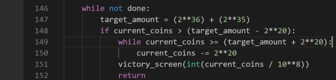
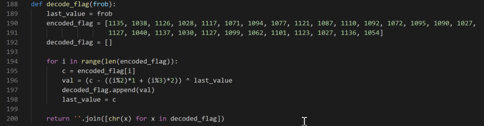
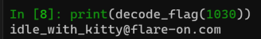
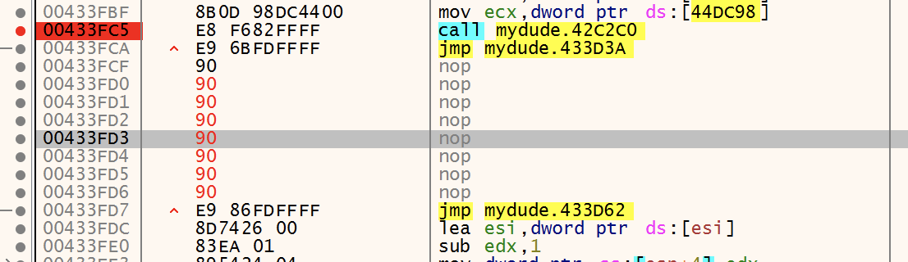
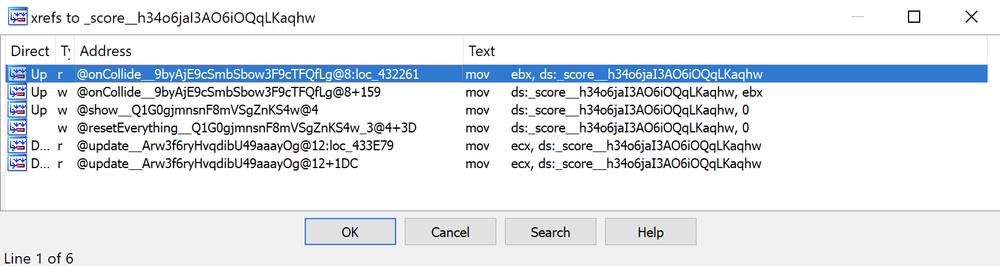
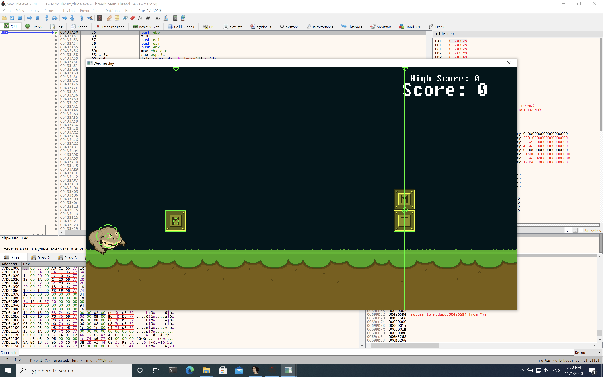
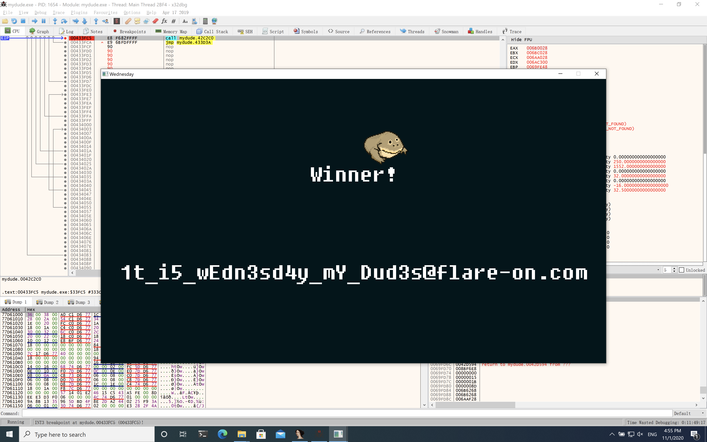
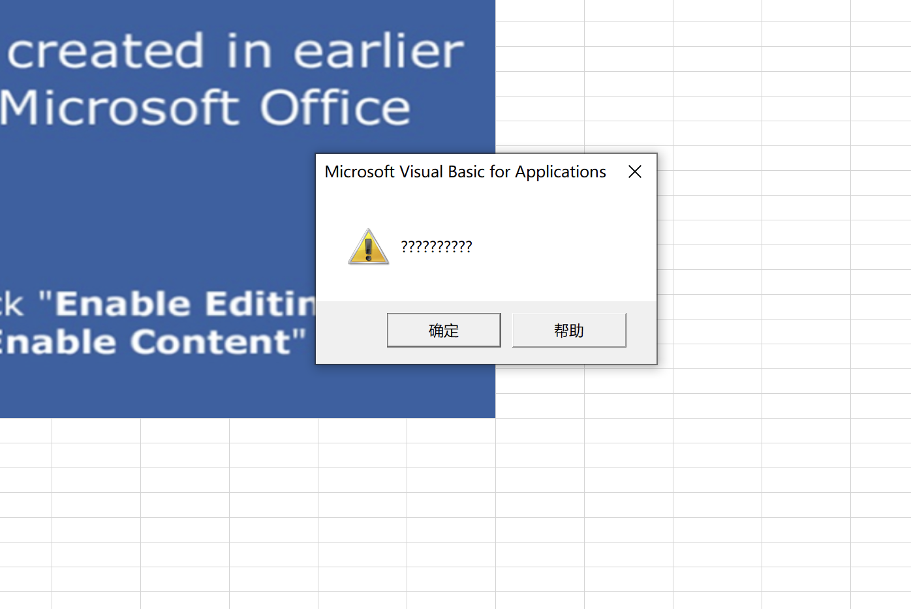
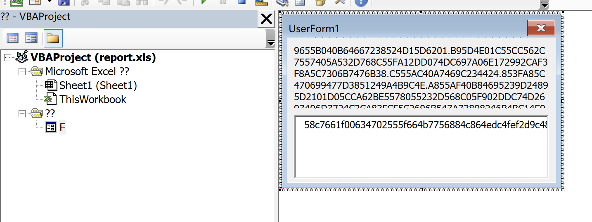
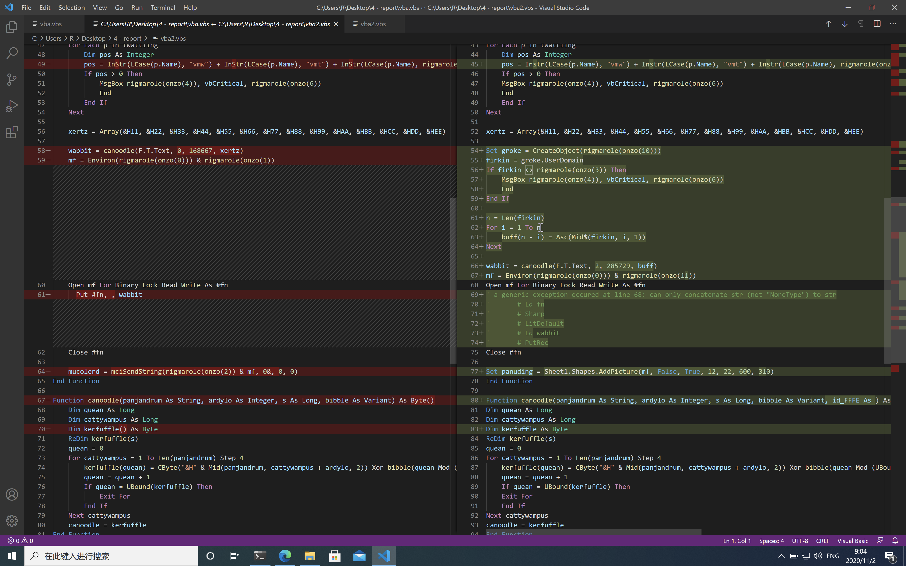

由于在我开始做题目时比赛仅剩一周，导致没有在比赛期间完成所有的题目，现将其补完。

## Ch1 Fidle

给出了源码，关键代码如下



通过该函数计算出token，将值传入



所以我们只需要出入一个`[target_amout-2**20, target_amount+2**20]`之间的数即可，token值为1030，得到flag



## Ch2 Garbage

## Ch3 Wednesday

该程序用sdl2库编写，简单看了一下网上的介绍，属于事件驱动模式的游戏。

拖入ida中查看，可以看到程序的函数名依旧保留，简单翻阅我们可以窥见一个叫做`resetEverything__Q1G0gjmnsnF8mVSgZnKS4w_3@4`的函数，在运行程序后我们在入口`00433A50`下断点。

故意与石块发生碰撞，可以看到栈回溯

```
0069FD2C  00433FD7  return to mydude.00433FD7 from mydude.00433A50   <-----------------update__Arw3f6ryHvqdibU49aaayOg@12
0069FD30  47AE147B  
0069FD34  3F847AE1  
0069FD38  0069FD48  
0069FD3C  00437BBF  return to mydude.00437BBF from mydude.0040C500   <-----------------update__giAKdkRYJ1A0Qn9asB8s9ajA@12
0069FD40  63D0F33D  
0069FD44  0000000A  
0069FD48  63D0F351  
0069FD4C  0000000A  
0069FD50  0069FD68  
0069FD54  74BFC2C3  return to sdl2.74BFC2C3 from ???
0069FD58  47AE147B  
0069FD5C  3F847AE1  
0069FD60  0000000F  
0069FD64  00000000  
0069FD68  0016A028  
0069FD6C  0042CCD7  return to mydude.0042CCD7 from mydude.00437AD0   <------------------@run__E9cSjWeb4G6NszYRcpo6sLA_2@4
```

以上栈回溯到`update`函数，`update`函数一般出现在事件的`callback`中，本题中则是游戏运行的主要`callback`。

尝试将`update__Arw3f6ryHvqdibU49aaayOg@12`中对`resetEverything__Q1G0gjmnsnF8mVSgZnKS4w_3`的调用patch，发现当发生碰撞后，不会重新开始，而是会继续游戏

patch位置如下，全部`nop`

```c
  if ( *(_BYTE *)(v3[10] + 249) == 1 )
    resetEverything__Q1G0gjmnsnF8mVSgZnKS4w_3((int)v3);
```

```asm
.text:00433FD0                 mov     ecx, ebx
.text:00433FD2                 call    @resetEverything__Q1G0gjmnsnF8mVSgZnKS4w_3@4
.text:00433FD7                 jmp     loc_433D62
```



但是游戏运行到胜利分数`296`时，程序缺直接崩溃，没有将flag打印出来。猜测是应为flag是根据每一个石块的上下跳跃是否正确来作为输入，如果直接nop，会产生不正确的输入，需要将每一个石块都判断为对。

回到`resetEverything__Q1G0gjmnsnF8mVSgZnKS4w_3`中，发现符号名`score__h34o6jaI3AO6iOQqLKaqhw`的变量，该变量用来存储分数，查看交叉引用



存在函数名为`onCollide__9byAjE9cSmbSbow3F9cTFQfLg`函数，推测为发生碰撞的处理函数（事实上发生石块上下均有碰撞体积，按F10可以看到），其中对`score__h34o6jaI3AO6iOQqLKaqhw`的处理可以明显看到如果判断正确则分数加1。



```c
            if ( *(char *)(v3 + 248) == *(unsigned __int8 *)(v24 + 248) )
            {
              v16 = score__h34o6jaI3AO6iOQqLKaqhw + 1;
              if ( __OFADD__(1, score__h34o6jaI3AO6iOQqLKaqhw) )
                raiseOverflow(v22);
              *(_BYTE *)(v3 + 24) = 1;
              score__h34o6jaI3AO6iOQqLKaqhw = v16;
              if ( !(unsigned __int8)isObj(*(_DWORD *)v3, (int)&NTI__bc9cIRpcNby7Dj3TH0kx9cWA_) )
                raiseObjectConversionError();
              v17 = incrSeqV3(*(int **)(v24 + 252), (int)&NTI__pxbIse2JUQkJU0n9blV9bY5g_);
```

那么将以下跳转改为`jmp`即可强制判断每次都正确。

```asm
.text:00432356                 cmp     edx, eax
.text:00432358                 jz      loc_432261
```

最终分数为296后，得到flag



## Ch4 Report

直接打开会提示错误不能运行



`alt+f11`进入vba的调试界面，得到如下代码

```
Private Declare Function InternetGetConnectedState Lib "wininet.dll" _
(ByRef dwflags As Long, ByVal dwReserved As Long) As Long

Private Declare PtrSafe Function mciSendString Lib "winmm.dll" Alias _
   "mciSendStringA" (ByVal lpstrCommand As String, ByVal _
   lpstrReturnString As Any, ByVal uReturnLength As Long, ByVal _
   hwndCallback As Long) As Long

Private Declare Function GetShortPathName Lib "kernel32" Alias "GetShortPathNameA" _
    (ByVal lpszLongPath As String, ByVal lpszShortPath As String, ByVal lBuffer As Long) As Long

Public Function GetInternetConnectedState() As Boolean
  GetInternetConnectedState = InternetGetConnectedState(0&, 0&)
End Function

Function rigmarole(es As String) As String
    Dim furphy As String
    Dim c As Integer
    Dim s As String
    Dim cc As Integer
    furphy = ""
    For i = 1 To Len(es) Step 4
        c = CDec("&H" & Mid(es, i, 2))
        s = CDec("&H" & Mid(es, i + 2, 2))
        cc = c - s
        furphy = furphy + Chr(cc)
    Next i
    rigmarole = furphy
End Function

Function folderol()
    Dim wabbit() As Byte
    Dim fn As Integer: fn = FreeFile
    Dim onzo() As String
    Dim mf As String
    Dim xertz As Variant
    
    onzo = Split(F.L, ".")
    
    If GetInternetConnectedState = False Then
        MsgBox "Cannot establish Internet connection.", vbCritical, "Error"
        End
    End If

    Set fudgel = GetObject(rigmarole(onzo(7)))
    Set twattling = fudgel.ExecQuery(rigmarole(onzo(8)), , 48)
    For Each p In twattling
        Dim pos As Integer
        pos = InStr(LCase(p.Name), "vmw") + InStr(LCase(p.Name), "vmt") + InStr(LCase(p.Name), rigmarole(onzo(9)))
        If pos > 0 Then
            MsgBox rigmarole(onzo(4)), vbCritical, rigmarole(onzo(6))
            End
        End If
    Next
        
    xertz = Array(&H11, &H22, &H33, &H44, &H55, &H66, &H77, &H88, &H99, &HAA, &HBB, &HCC, &HDD, &HEE)

    wabbit = canoodle(F.T.Text, 0, 168667, xertz)
    mf = Environ(rigmarole(onzo(0))) & rigmarole(onzo(1))
    Open mf For Binary Lock Read Write As #fn
      Put #fn, , wabbit
    Close #fn
    
    mucolerd = mciSendString(rigmarole(onzo(2)) & mf, 0&, 0, 0)
End Function

Function canoodle(panjandrum As String, ardylo As Integer, s As Long, bibble As Variant) As Byte()
    Dim quean As Long
    Dim cattywampus As Long
    Dim kerfuffle() As Byte
    ReDim kerfuffle(s)
    quean = 0
    For cattywampus = 1 To Len(panjandrum) Step 4
        kerfuffle(quean) = CByte("&H" & Mid(panjandrum, cattywampus + ardylo, 2)) Xor bibble(quean Mod (UBound(bibble) + 1))
        quean = quean + 1
        If quean = UBound(kerfuffle) Then
            Exit For
        End If
    Next cattywampus
    canoodle = kerfuffle
End Function
```

以及一个叫做`F`的窗体



以上vba代码可以用[oletools](https://github.com/decalage2/oletools)dump出来。注意到以上代码的主要逻辑由`folderol()`函数完成，结合解码函数`rigmarole()`与`canoodle()`，向特定路径下生成了一个mp3文件。


名字为pcode，播放了一段鼓点似的音乐...这里实在没有想到

于是将目光专向pcode，根据[offical-wp](https://www.fireeye.com/content/dam/fireeye-www/blog/pdfs/flareon7-challenge4-solution.pdf)，我们使用[pcode2code](https://pypi.org/project/pcode2code/)可以发现少许的不同



dump出的代码多了一些功能，将`F.T`后偏移一定字节的数据解码后写入png文件中，于是将该png抠出来


得到flag
