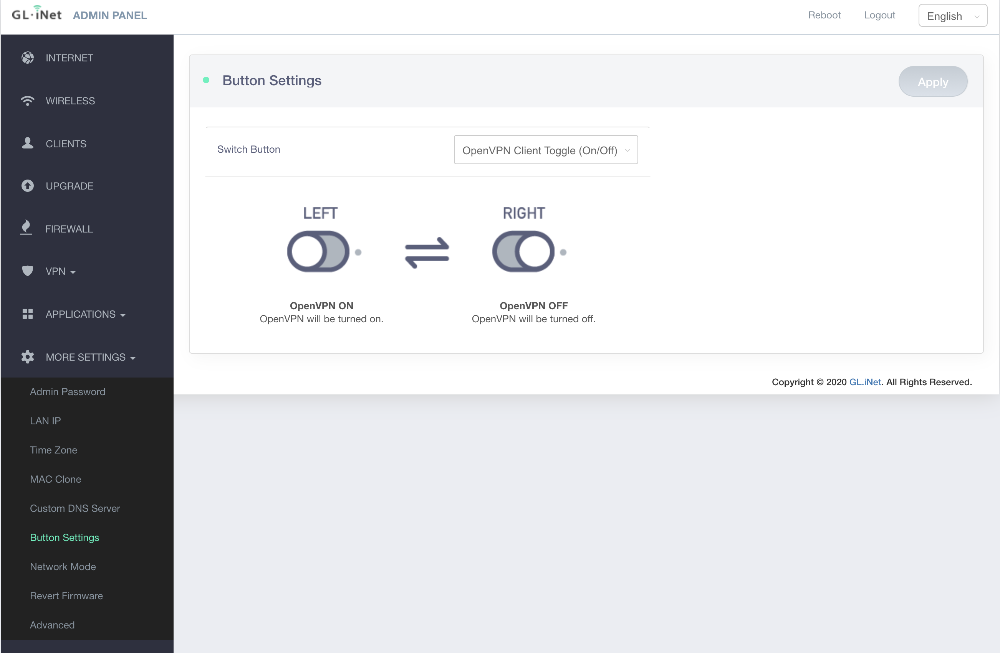

* TOC
{:toc}

## 测试设备

+ GL-inet GL-AR300M
+ 大陆可直连VPS
    + 系统为 CentOS

其中GL-AR300M淘宝上购买价格为215，配置如下

+ CPU QCA9531, @650MHz SoC
+ Memory/Storage	DDR2 128MB/FLASH 16MB
+ Wi-Fi Speed	300Mbps (2.4GHz)

## 解决方案

在出差的时候通过随身设备桥接当前wifi，使用mbp的usb供电，手机与笔记本连接设备热点即可科学上网。其中目前反GFW较好方案是v2ray，透明流量传输较好的方案是vpn（v2ray+iptables并不能解决非tcp/udp协议传输），所以使用openvpn over proxy来综合使用。

### v2ray

nginx+websocket

nginx主要用来解决主动探测问题，只有当访问特定路径时才将流量转发给v2ray处理

安装脚本使用[install.sh](https://raw.githubusercontent.com/wulabing/V2Ray_ws-tls_bash_onekey/master/install.sh)，交互式，傻瓜安装。

项目地址为[wulabing/V2Ray_ws-tls_bash_onekey](https://github.com/wulabing/V2Ray_ws-tls_bash_onekey)

其中域名需要自己提前准备。

### openvpn

根据官网[access server](https://openvpn.net/download-open-vpn/)方法安装openvpn_as即可

其中chrome可能会报ssl证书不安全，且无法跳过

选中当前页面为顶层，并输入`thisisunsafe`，或参考其他[一劳永逸方案](https://segmentfault.com/a/1190000021843971)

值得注意额度是，在我的测试中存在DNS无法正常解析的情况，这时候需要将vpnserver的dns推给client，修改的地方为`CONFIGURATION->VPN Settings->DNS Settings->Have clients use specific DNS servers`，并设置主备DNSserver。

注意在使用proxy的client只能通过tcp进行连接，并且需要在client的配置文件中加上

```
http-proxy 127.0.0.1 1087
```

### 其他一些配置

GLinet需要调整为英文配置，否则有些选项看不到


如果我们需要vpn断线立即则断网，则需要设置`Internet Kill Switch`


我们需要将v2ray设置为开机自启动，其中先安装[openwrt-v2ray](https://github.com/kuoruan/openwrt-v2ray)

```bash
wget -O kuoruan-public.key http://openwrt.kuoruan.net/packages/public.key
opkg-key add kuoruan-public.key
echo "src/gz kuoruan_packages http://openwrt.kuoruan.net/packages/releases/$(. /etc/openwrt_release ; echo $DISTRIB_ARCH)" >> /etc/opkg/customfeeds.conf
opkg update
opkg install v2ray-core-mini # or v2ray-core
```

添加启动项

```bash
root@GL-AR300M:~# cat /etc/init.d/v2ray
#!/bin/sh /etc/rc.common
# Copyright (C) 2013 OpenWrt.org
USE_PROCD=1

START=99
STOP=99

# SERVICE_DAEMONIZE=1
# SERVICE_WRITE_PID=1

CONF=/etc/v2ray/config.json
EXEC=/usr/bin/v2ray

start_service() {
  procd_open_instance
  procd_set_param command $EXEC -config $CONF
  procd_set_param file $CONF
  procd_set_param user v2ray
  # procd_set_param respawn # respawn automatically if something died, be careful if you have an alternative process supervisor
  procd_close_instance
}

start() {
        service_start $EXEC
}

stop() {
        service_stop $EXEC
}

reload() {
        service_reload $EXEC
}
```

同时可以设置openvpn的物理快捷键



## 测试

### icmp协议

在另外一台公网服务器上用`tcpdump`抓包，在本地`ping`

`tcpdump -nn -i any icmp`

```bash
➜  ~ ping 47.111.128.101
PING 47.111.128.101 (47.111.128.101): 56 data bytes
64 bytes from 47.111.128.101: icmp_seq=0 ttl=47 time=371.484 ms
64 bytes from 47.111.128.101: icmp_seq=1 ttl=47 time=381.422 ms
64 bytes from 47.111.128.101: icmp_seq=2 ttl=47 time=305.823 ms
```

```bash
root@None:~# tcpdump -nn -i any icmp
tcpdump: verbose output suppressed, use -v or -vv for full protocol decode
listening on any, link-type LINUX_SLL (Linux cooked v1), capture size 262144 bytes
14:31:30.380540 IP 80.251.220.157 > 172.16.177.225: ICMP echo request, id 12300, seq 0, length 64
14:31:30.380596 IP 172.16.177.225 > 80.251.220.157: ICMP echo reply, id 12300, seq 0, length 64
14:31:31.396322 IP 80.251.220.157 > 172.16.177.225: ICMP echo request, id 12300, seq 1, length 64
14:31:31.396364 IP 172.16.177.225 > 80.251.220.157: ICMP echo reply, id 12300, seq 1, length 64
14:31:32.376861 IP 80.251.220.157 > 172.16.177.225: ICMP echo request, id 12300, seq 2, length 64
14:31:32.376907 IP 172.16.177.225 > 80.251.220.157: ICMP echo reply, id 12300, seq 2, length 64
```

可以看到ip已经发生了变化

### 网速测试

本地v2ray网速测试


GLinet v2ray+openvpn网速测试


说明计算能力太差，急需更新配置

## 最终解决方案

在横向对比了Glinet的三个不同价位的产品之后，选择了GL-MV1000W（最无性价比的方案），在MBP的usb供电下可以跑到20Mb速度，后续有机会将尝试树莓派和NanoPI等开发板，但是由于自带缺少无线桥接等功能，最终可能很难便捷的使用。
